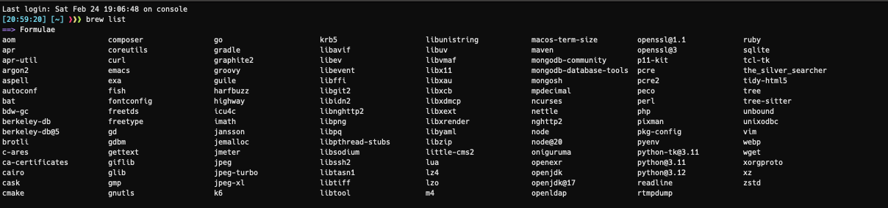

# A Quickstart Guide to MacOS Big Sur

## First things to check after purchase

- You are connected to your apple id.
- Your fingerprint has been recorded and registered with 'Touch ID' for easier unlocks and purchases on your Mac.
- Your voice has been recorded and registered with 'Siri'.
- Updates from 'App Store' and 'Software Update' has been successfully installed if available.
- Backup of your system has been taken by 'Time Machine'.

## Applications to install

### General installations and homebrew packages

- [ag](https://www.cyberciti.biz/open-source/command-line-hacks/ag-supercharge-string-search-through-directory-hierarchy/) (install via `brew install the_silver_searcher`) (This tool required as a dependency for peco plugin)
- Adobe Acrobat Reader
- Android Studio
- AnyDesk
- Apache JMeter
- Apache Maven
- AppCleaner
- Appium Desktop
- Brave Browser
- [bat](https://github.com/sharkdp/bat) (install via `brew install bat`)
- Box
- Charles
- cmake (install via `brew install cmake`)
- composer (install via `brew install composer`)
- DBeaver Community Edition
- Docker Desktop
- exa: [exa-official](https://the.exa.website/), [exa-github](https://github.com/ogham/exa) (install via `brew install exa`)
- Firefox Browser
- [Fish Shell](https://fishshell.com/) (install via `brew install fish`)
- [fd](https://github.com/sharkdp/fd) (install via `brew install fd`)
- [fzf](https://github.com/junegunn/fzf) (install via `brew install fzf`, install key-bindings via `$(brew --prefix)/opt/fzf/install`)
- Git
- GitHub Desktop
- Google Chrome
- go (install via `brew install go`)
- gradle (install via `brew install gradle`)
- Grammarly for Safari
- groovy (install via `brew install groovy`)
- Homebrew
- IntelliJ IDEA Community Edition
- iTerm2
- Java SE Development Kit 8
- Java SE Development Kit 11
- Java SE Development Kit 21
- jmeter (install via `brew install jmeter`)
- K6 (install via `brew install k6`)
- MAMP
- maven (install via `brew install maven`)
- Microsoft Teams
- [mongodb-community](https://www.mongodb.com/docs/manual/tutorial/install-mongodb-on-os-x/) (install via the following commands: `brew tap mongodb/brew`, `brew update`, `brew install mongodb-community`)
- nvm (install via `brew install nvm`)
- [Node.js](https://nodejs.org/en/download/) (recommended: install via nvm, `nvm install --lts`) (alternative installation via brew, `brew install node@20`) (alternatively, download the .pkg file for macOS and upgrade via the following commands: `sudo npm cache clean -f`, `sudo npm install -g n`, `sudo n stable`)
- [Oh My Fish](https://github.com/oh-my-fish/oh-my-fish)
- [Oh My Zsh](https://ohmyz.sh/)
- [peco](https://github.com/peco/peco) (install via `brew install peco`)
- php (install via `brew install php`)
- Pieces for Developers
- Postgres.app
- Postman
- PyCharm Community Edition
- python@3.12 (recommended: install via pyenv, `pyenv install 3.12.2; pyenv global 3.12.2`) (alternative installation via brew, `brew install python@3.12`) (to access python from terminal create a symbolic link using `brew link --overwrite python@3.12`, another command to do the same is via creating the symbolic link using `ln -s /opt/homebrew/Cellar/python@3.12/3.12.2/bin/python3 /opt/homebrew/bin/`)
- python-tk@3.12 (required to access `idle3` command from Terminal) (install via `brew install python-tk@3.12`)
- [ripgrep](https://github.com/BurntSushi/ripgrep) (install via `brew install ripgrep`)
- Spring Tool Suite
- Splashy (Wallpaper changing tool)
- Sublime Text
- sshpass
- The Unarchiver
- tree (install via `brew install tree`)
- vim (install via `brew install vim` - not recommended to use the vim that comes bundled with preinstalled macOS)
- Visual Studio Code
- VNC Viewer
- Vysor
- WPS Office
- wget (install via `brew install wget`)
- XCode
- Zoom
- [z](https://github.com/agkozak/zsh-z) (install via `git clone https://github.com/agkozak/zsh-z.git ~/.zprezto-contrib/zsh-z`, search for the phrase 'plugins' inside .zshrc file and append the plugin name as following: `plugins=(git zsh-z)`)
- [zsh-autosuggestions](https://github.com/zsh-users/zsh-autosuggestions) (install via `git clone https://github.com/zsh-users/zsh-autosuggestions ${ZSH_CUSTOM:-~/.oh-my-zsh/custom}/plugins/zsh-autosuggestions`, search for the phrase 'plugins' inside .zshrc file and append the plugin name as following: `plugins=(git zsh-z zsh-autosuggestions)`)

## Installing Homebrew on Mac Intel and M1 chip

### Command for Intel and M1 chip

- `/bin/bash -c "$(curl -fsSL https://raw.githubusercontent.com/Homebrew/install/HEAD/install.sh)"`
- Brew installation directory in Intel: /usr/local
- Brew installation directory in M1 chip: /opt/homebrew

### Essential Homebrew commands

#### General commands

- `brew --version` : Display the version of Homebrew.
- `brew help` : Print help information.
- `brew help <sub-command>` : Print help info for a brew command.
- `brew list` : Lists all the packages installed via Homebrew.
- `brew list <package-name>` : Lists the files and directories that got downloaded during the installation of the package.
- `brew list --versions <package-name>` : Check the versions of package you have installed.
- `brew switch <package-name> <version>` : Change versions for a package.
- `brew install <package-name` : Install the given package.
- `brew uninstall <package-name>` : Uninstall the given package.
- `brew upgrade <package-name>` : Upgrade the given package.
- `brew link <package-name>` : Create symbolic links for the given package.
- `brew unlink <package-name>` : Remove symbolic links for the given package.

#### Most commonly used brew commands

- `brew list`
- `brew update`
- `brew outdated`
- `brew upgrade`
- `brew cleanup`
- `brew install <package-name>`
- `brew uninstall <package-name>`
- `brew uninstall --ignore-dependencies <package-name>`
- `brew link <package-name>`

#### Cask commands

- `brew list --cask` : List installed applications (Note: Cask commands are used for interacting with graphical applications i.e. Firefox).
- `brew install --cask <package-name>` : Install the given package.
- `brew uninstall --cask <package-name>` : Uninstall the given package.
- `brew reinstall --cask <package-name>` : Reinstall the given package.

#### Additional Homebrew commands

- `brew info <package-name>` : Display information about the package.
- `brew cleanup` : Remove older versions of all installed packages.
- `brew cleanup -n` : Display all the package what will be removed (dry run).
- `brew cleanup <package-name>` : Remove older versions of specified package.
- `brew search <package-name>` : Perform a substring search of the package given.

#### Global Homebrew commands

- `brew update` : Fetch latest version of Homebrew, cask and packages installed.
- `brew upgrade` : Upgrade all packages.
- `brew upgrade <package-name>` : Upgrade the specified package.
- `brew pin <package-name>` : Prevent the specified package from being upgraded.
- `brew unpin <package-name>` : Allow the specified package to be upgraded.
- `brew list` : List installed packages.
- `brew outdated` : Check what is due for upgrade.
- `brew doctor` : Check system for potential problems.

### Homebrew Installed Packages

- List of packages installed via homebrew is given below:

  

## nvm - Node Version Manager

nvm (Node Version Manager) is a tool that allows you to install and manage multiple versions of Node.js on your Mac. nvm is a version manager for node.js, designed to be installed per-user, and invoked per-shell.

### Commonly used nvm commands

- Check the version of nvm installed:  
  `nvm -v`  
  `nvm --version`
- Install the latest version of Node.js:  
  `nvm install node`  
  `nvm install latest`
- Install the LTS version of Node.js:  
  `nvm install --lts`
- View a list of all the remotely available Node.js versions that we can install with nvm:  
  `nvm ls-remote`  
  `nvm list-remote`
- View a list of all the locally available Node.js versions that we can use:  
  `nvm ls`  
  `nvm list`
- Install a specific version of Node.js, such as version 20:  
  `nvm install 20`
- Once the desired version of Node.js is installed, you can use it by running the following command:  
  `nvm use 16` (Use the given version)  
  `nvm use --lts` (Use the LTS version)  
  `nvm use latest` (Use the latest version)  
  `nvm use node` (Use the latest version)
- Set the default version: If you want to use a specific version of Node.js by default, you can set it as the default version using the following command:  
  `nvm alias default 20`
- To uninstall a specific Node.js version, run:  
  `nvm uninstall 14.18.1`

### Installation and configuration of nvm and Node.js

```bash
# Install nvm via brew
brew install nvm

# If your system already has a Node.js installed, uninstall it first. If Node.js is installed node via Homebrew, uninstall using the following commands:
brew uninstall --ignore-dependencies node
brew uninstall --force node

# Add nvm to your shell profile: To make nvm available every time you open a new terminal window, you will need to add the following lines to your shell profile (e.g., ~/.bash_profile or ~/.zshrc):
export NVM_DIR=~/.nvm
source $(brew --prefix nvm)/nvm.sh

# Verify nvm installation and check the version
nvm --version

# Install and use the LTS version of Node.js
nvm install --lts

# Verify Node.js installation and check the version
node --version
npm --version
```

### NPM global packages

- appium-doctor
- appium
- corepack
- csslint
- ffprobe
- jshint
- localtunnel
- n
- npm
- typescript

### Commonly used npm commands

- `npm list -g`: Lists all globally installed packages
- `npm install -g <package-name>`: Install a package which is globally accessible
- `npm install <package-name>`: Install a package which is accessible only in a local directory
- `npm uninstall -g <package-name>`: Uninstall a globally accessible package
- `npm uninstall <package-name>`: Uninstall a locally (within a directory) accessible package
- `npm update -g <package-name>`: Updates the globally accessible package. Package name is optional. If no package is given then it updates all the globally accessible packages
- `npm update <package-name>`: This command updates the specified package. Package name is optional. If no package is specified then it updates all the packages in the specified location
- `npm -g outdated`: Checks the registry if any (or specified) globally accessible package is outdated. It prints a list of all packages which are outdated
- `npm doctor`: Checks our environment so that our npm installation has what it needs to manage our JavaScript packages
- `npm init`: Creates a package.json file in our directory. It basically asks some questions and finally creates a package.json file in the current project directory
- `npm start`: Runs a command that is defined in the start property in the scripts. If not defined it will run the node server.js command
- `npm build`: It is used to build a package
- `npm -g ls` / `npm -g list`: Lists all the globally installed packages as well as their dependencies
- `npm help`: Searches npm help documentation for a specified topic. It is used whenever the user needs help to get some reference
- `npm search <search-term>`: Searches the npm registry for packages matching the search terms
- `npm version`: Bumps a package version

## pyenv - Simple Python Version Management tool

- pyenv lets you easily switch between multiple versions of Python. It's simple, unobtrusive, and follows the UNIX tradition of single-purpose tools that do one thing well.
- Official documentation: [https://github.com/pyenv/pyenv](https://github.com/pyenv/pyenv)
- Introduction to pyenv: [https://realpython.com/intro-to-pyenv/](https://realpython.com/intro-to-pyenv/)

### Commonly used pyenv commands

- `pyenv install --list`: This command lists all available python versions, you can use grep to find a specific Python version
- `pyenv install --list | grep " 3\.[678]"`: List all the available CPython 3.6 through 3.8
- `pyenv install 2.7.15`: This command can be used to install a specific version of Python.
- `pyenv install -v 3.11.5`: The install command with -v flag ensures to display all the steps of installing the specified version of Python.
- `pyenv uninstall 2.7.15`: This command can be used to uninstall a specific version of Python.
- `pyenv versions`: The versions command displays all currently installed Python versions
- `pyenv version`: This command is similar to versions but only shows you the current active Python version.
- `pyenv which python`: The which command is helpful for determining the full path to a system executable. Because pyenv works by using shims, this command allows you to see the full path to the executable pyenv is running. The output displays the full system path for pip. This can be helpful when you’ve installed command-line applications.

### Create Virtual Environments in VSCode

#### Command-line approach

- Open up the directory where you want the virtual environment to be created in Terminal
- Type the command: `python3 -m venv <venv-directory-name>`
- Above command will create a virtual environment with the default Python version installed on your system.
- Alternatively if you want to create a virtual environment with a different Python version, you can use this command: `</path/to/python> -m venv <venv-directory-name>`
- Activation and deactivation commands:

  ```bash
  python3 -m venv .venv
  source .venv/bin/activate
  deactivate
  ```

#### Create virtual environment using VSCode extension

- Install a VSCode extension called 'Python' from marketplace
- - Open up the directory where you want the virtual environment to be created in VSCode
- Press `Command + Shift + P` to open up command palette
- Search and select the option 'Python: Create Environment...'
- Select environment type as 'venv'
- Choose Python interpreter version
- Virtual environment with the given Python interpreter version will be inside on the '.venv' directory

### Installation and configuration to support multiple Python versions

```bash
# Install pyenv via brew
brew install pyenv

# Install the latest versions of python2 and python3
pyenv install 2.7.18
pyenv install 3.12.2

# Set both python2 and python3 globally accessible
pyenv global 2.7.18 3.12.2

# Append the following line at the end of '.zshrc'/'.bashrc' file depending on your default shell
# Note: Appending the following line may not work in '.zshenv' / '.bashenv' / '.bash_profile' etc. files
export PATH=$(pyenv root)/shims:$PATH

# Verification of configuration
# python/python2 -> Should point to Python 2.7.18
# python3 -> Should point to Python 3.12.0
which python
# /Users/deepjyoti.barman/.pyenv/shims/python

which python3
# /Users/deepjyoti.barman/.pyenv/shims/python3

pyenv which python
# /Users/deepjyoti.barman/.pyenv/versions/2.7.18/bin/python

pyenv which python3
# /Users/deepjyoti.barman/.pyenv/versions/3.12.0/bin/python3
```

### PIP3 global packages

- pip
- setuptools
- six
- wheel

### Commonly used pip commands

- `pip3 list`: List all the packages
- `pip list`: List all the packages (sometimes output of pip3 and pip commands can be different in a mac machine)
- `pip3 install --upgrade <package-name>`: Upgrade the given package
- `pip install --upgrade <package-name>`: Upgrade the given package
- `pip3 list --outdated`: List all the outdated packages
- `pip list --outdated`: List all the outdated packages

## The necessary trackpad tweak

- Click on the `Apple` menu -> Go to `System Preferences` -> `Trackpad`
  1. Check `Tap to click`.
  2. Increase tracking speed to 5.

## Enable zoom feature

- Click on the `Apple` menu -> Go to `System Preferences` -> `Accessibility` -> `Zoom`
  1. Check `Use keyboard shortcuts to zoom`.
  2. Check `Enable Hover Text` (check this only if its required).

## Enable three finger drag or select feature

- Click on the `Apple` menu -> Go to `System Preferences` -> `Accessibility` -> `Pointer Control`
  1. Under `Mouse & Trackpad` click on `Trackpad Options...`
  2. Enable `Use trackpad for dragging`
  3. Select `Three-Finger Drag` from the drop down menu
  4. Click on `OK` and close the menu

## Invert mouse scroll direction

Click on the `Apple` menu -> Go to `System Preferences` -> `Mouse` -> Untick `Scroll direction: Natural`.

## Overwrite behavior of CAPS LOCK key with ESC

- Click on the `Apple` menu -> Go to `System Settings...` -> `Keyboard`
- Click on `Keyboard Shortcuts...`
- Click on `Modifier Keys`
- Select the keyboard of your choice from the dropdown and assign the following value:
  - `Caps Lock Key`: `Escape`

## Display all sidebar items in Finder

Open up 'Finder' -> Click on `Finder` in the menu bar -> `Preferences` -> `Sidebar` -> Check all possible items you want to show on the sidebar.

## Changing workspace

- Swipe left or right with three or four fingers on trackpad.
- Swipe left or right with two fingers on magic mouse.
- `Control + Right_Arrow` : To switch to the workspace on the right.
- `Control + Left_Arrow` : To switch to the workspace on the left.
- Open Mission Control by swiping up with three or four fingers to have an overview of all the workspaces running.

## Reinstall MacOS from MacOS recovery

**Note**: Make sure you have an active internet connection, Mac is plugged into the power / charger and it's turned off.

- Key combinations:
  1. `Command + R`  
     Reinstall the latest version of MacOS installed on your Mac (Recommended for most users).
  2. `Command + Option + R`  
     Upgrade to the latest version of MacOS compatible to your device.
  3. `Command + Option + Shift + R`  
     Reinstall the version of MacOS that came with your Mac.
- Turn on your Mac and immediately press and hold the key combinations of your choice until you see an Apple logo.
- Enter the admin password.
- Click on `Next`.
- Select `Reinstall MacOS` from 'MacOS Utilities'.
- Click on `Continue`.
- Follow the on-screen options.
- When it's done you will see a login window, enter the password and continue with the prompts.

**Tip**: When to do factory reset / reinstall MacOS?

- When you are selling your Mac.
- Changing admin name.
- To fix software issues.

## Granting Microsoft Teams, Zoom and other softwares resource and device access permissions

Following are the steps to grant 'Microsoft Teams' permission for 'Screen Recording'.

- Click on `Apple` menu -> `System Preferences` -> `Security and Privacy`
- Click on `Privacy` tab.
- Click on `Screen Recording` from the LHS side bar.
- Click on the lock icon to make changes.
- Provide admin password / touch id.
- Click on the checkbox next to 'Microsoft Teams'. If 'Microsoft Teams' is not there as an option then click on the '+' icon and add 'Microsoft Teams' from the Applications folder.
- Click on the unlock icon to lock the changes you have made.
- Close the `Security and Privacy` window.
- Quit 'Microsoft Teams' and reopen it to enact the changes made.

**Tip**: List of necessary permissions for apps,

- Microsoft Teams: Accessibility, Camera, Microphone, Screen Recording.
- Zoom: Accessibility, Screen Recording.
- Terminal: Full Disk Access.
- iTerm2: Full Disk Access.

## How to format an external hard disk drive in Mac

**Tip**: In this guide, we're using exFAT instead of FAT32, another filesystem that both Windows and Mac can read and write to, because FAT32 has a maximum 4GB file size limit whereas exFAT can work with files as large as 16EB (exabytes). exFAT also performs better than FAT32.

You can format the drive from either Mac or Windows. However, if you want to use part of the drive for OS X's Time Machine backups, you should do this from the Mac, since there's an extra step to make the drive compatible for Time Machine.

Formatting of the device can be done by following the steps given below:

- Connect an external hard drive to your Mac.
- Open 'Spotlight Search' by pressing `Command + Spacebar`, type in Disk Utility, and click the first option. This will open the Disk Utility app, where you will find all the internal and external drives that are connected to your Mac.
- Choose `View` -> `Show All Devices`
- In the sidebar, select the storage device you want to erase, then click the Erase button.
- Click the Scheme pop-up menu, then choose GUID Partition Map.
- Click the Format pop-up menu, then choose a file system format.
- Enter a name.
- (Optional) If available, click Security Options, use the slider to choose how many times to write over the erased data, then click OK.
  [Note: Secure erase options are available only for some types of storage devices. If the Security Options button is not available, Disk Utility cannot perform a secure erase on the storage device.]
- Click Erase, then click Done.

## Terminal configuration

Open up 'Terminal' -> Click on `Terminal` in the menu bar -> `Preferences`

- Select the `General` tab

  1. `On startup, open`: `New window with profile` - `Pro`
  2. `New windows open with`: `Same Profile`

- Select the `Profiles` tab
  1. `Text` tab
     - Select profile `Pro` and click on `Default` button
     - Check `Blink Cursor`
     - Click on `Colors and Effects` -> `Opacity`: `80%`
     - Click on `Change` button next to `Font` -> `Line Spacing`: `1.1`
  2. `Window` tab
     - `Columns`: `170`, `Rows`: `40`

## iTerm2 configuration

### Install Powerline and Nerd fonts

- Powerline fonts GitHub page: [powerline/fonts](https://github.com/powerline/fonts)
- Nerd fonts official website: [NerdFonts](https://www.nerdfonts.com/)
- Nerd fonts GitHub page: [ryanoasis/nerd-fonts](https://github.com/ryanoasis/nerd-fonts)
- Installation guide for all Powerline fonts:

  ```sh
  # clone
  git clone https://github.com/powerline/fonts.git --depth=1
  # install
  cd fonts
  ./install.sh
  # clean-up a bit
  cd ..
  rm -rf fonts
  ```

- Un-installation guide for all Powerline fonts:
  - Run ./uninstall.sh to uninstall all Powerline Fonts.
- Installation guide for 'Hack Nerd Font':

  ```sh
  brew tap homebrew/cask-fonts
  brew install --cask font-hack-nerd-font
  ```

- Note: this installation is required to support sign and symbols present in oh-my-zsh / oh-my-fish themes.

### General configuration

Open up 'iTerm2' -> Click on `iTerm2` in the menu bar -> `Preferences`

#### Profiles Tab

1. General Tab:
   - Click on `+` icon to create a profile.
   - `Name`: `Deepjyoti`
   - `Title`: `Profile: Name (Job + Args)`
   - Select the newly created profile -> Click on `Other Actions` -> `Set  as Default`
   - (Optional) `Send text at start`: `sshpass -e ssh deepjb@192.168.30.15`
2. Text Tab:
   - Check `Blinking Cursor`.
   - Set `Font` as the following:  
     `Hack Nerd Font Mono` `Regular` `10` `100` `110`
   - Check `Anti-aliased`
   - Uncheck `Draw bold text in bold font`
3. Window Tab:
   - `Transparency`: `17` (Press `Command + U` to set transparency level to 0)
   - `Blending`: `50`
   - `Settings for New Windows`:
     `Columns`: `200`, `Rows`: `55`

#### Keys Tab

- Click on `Navigation Shortcuts` and change the settings as the following:
  - `Shortcut to activate a window`: `Option + Command + Number`
  - `Shortcut to select a tab`: `Option + Number`
  - `Shortcut to choose a split pane`: `Command + Number`

### Install a colorscheme for iTerm2

- Pay a visit to [Iterm2-color-schemes](https://iterm2colorschemes.com).
- Search and click on `Monokai Remastered` colorscheme.
- Save the configuration in a file and name it 'monokai-remastered.itermcolors'.
- Open up 'iTerm2' -> Click on `iTerm2` in the menu bar -> `Preferences` -> `Profiles`
- Click on 'Colors' tab.
- Click on the `Color Presents...` dropdown -> `Import`
- Choose the 'monokai-remastered.itermcolors' file from your local system.
- Select the theme.
- Close the `Preferences` dialog box.
- **Resources**: The 'monokai-remastered.itermcolors' colorscheme file has been added in this repository.

### Some important iTerm2 shortcuts

- Split Horizontally with Current Profile: `Command + Shift + D`
- Split Vertically with Current Profile: `Command + D`
- Split Horizontally with Custom Profile: `Command + Option + Shift + H`
- Split Vertically with Custom Profile: `Command + Option + Shift + V`
- Switch Tabs: `Control + Number`
- Switch Split Panes: `Command + Number`
- Close Split Pane/Tab: `Command + W`

### Oh-My-Zsh plugin

#### Installation (omz)

- Pay a visit to [Oh-My-Zsh](https://github.com/ohmyzsh/ohmyzsh) for detailed information.
- Install the plugin via entering the following `curl` command:  
  `sh -c "$(curl -fsSL https://raw.githubusercontent.com/ohmyzsh/ohmyzsh/master/tools/install.sh)"`

#### Commands (omz)

- Update this plugin: `omz update`
- Prints out the help message: `omz help`
- Manage Plugin: `omz plugin <plugin-name>`
- Manage Theme: `omg theme <theme-name>`
- Show the version of oh-my-zsh installed: `omz version`
- Reload the current zsh session: `omz reload`

#### Theme installation (omz)

- Different type of themes can be downloaded from the following links:
  - [Current Themes](https://github.com/ohmyzsh/ohmyzsh/wiki/Themes)
  - [Legacy Themes](https://github.com/ohmyzsh/ohmyzsh/wiki/Themes-%28legacy%29)
  - [External Themes](https://github.com/ohmyzsh/ohmyzsh/wiki/External-themes)
- Current theme and legacy theme names can be directly used inside .zshrc as `ZSH_THEME="agnoster"` and it will work fine.
- For external themes you need to download the theme, extract the .zip file, copy the .zsh-theme file inside `~/.oh-my-zsh/custom/themes` directory and then the name can be used inside .zshrc file.
- **Resources**: The 'passion.zsh-theme' theme file has been added in this repository. Before you use this theme install 'coreutils' via `brew install coreutils` command.
  It is necessary as the theme needs gdate utility as its dependency which is available in this package.

#### Complete Configuration (omz)

- Configure your `~/.zshrc` as the following:

  ```zsh
  # If you come from bash you might have to change your $PATH.
  # export PATH=$HOME/bin:/usr/local/bin:$PATH

  # Path to your oh-my-zsh installation.
  export ZSH="/Users/deepjyoti.barman/.oh-my-zsh"

  # Set name of the theme to load --- if set to "random", it will
  # load a random theme each time oh-my-zsh is loaded, in which case,
  # to know which specific one was loaded, run: echo $RANDOM_THEME
  # See https://github.com/ohmyzsh/ohmyzsh/wiki/Themes
  # ZSH_THEME="pygmalion"
  ZSH_THEME="passion"

  # Set list of themes to pick from when loading at random
  # Setting this variable when ZSH_THEME=random will cause zsh to load
  # a theme from this variable instead of looking in $ZSH/themes/
  # If set to an empty array, this variable will have no effect.
  # ZSH_THEME_RANDOM_CANDIDATES=( "robbyrussell" "agnoster" )

  # Uncomment the following line to use case-sensitive completion.
  # CASE_SENSITIVE="true"

  # Uncomment the following line to use hyphen-insensitive completion.
  # Case-sensitive completion must be off. _ and - will be interchangeable.
  # HYPHEN_INSENSITIVE="true"

  # Uncomment the following line to disable bi-weekly auto-update checks.
  DISABLE_AUTO_UPDATE="true"

  # Uncomment the following line to automatically update without prompting.
  DISABLE_UPDATE_PROMPT="true"

  # Uncomment the following line to change how often to auto-update (in days).
  # export UPDATE_ZSH_DAYS=13

  # Uncomment the following line if pasting URLs and other text is messed up.
  # DISABLE_MAGIC_FUNCTIONS="true"

  # Uncomment the following line to disable colors in ls.
  # DISABLE_LS_COLORS="true"

  # Uncomment the following line to disable auto-setting terminal title.
  # DISABLE_AUTO_TITLE="true"

  # Uncomment the following line to enable command auto-correction.
  # ENABLE_CORRECTION="true"

  # Uncomment the following line to display red dots whilst waiting for completion.
  # You can also set it to another string to have that shown instead of the default red dots.
  # e.g. COMPLETION_WAITING_DOTS="%F{yellow}waiting...%f"
  # Caution: this setting can cause issues with multiline prompts in zsh < 5.7.1 (see #5765)
  # COMPLETION_WAITING_DOTS="true"

  # Uncomment the following line if you want to disable marking untracked files
  # under VCS as dirty. This makes repository status check for large repositories
  # much, much faster.
  # DISABLE_UNTRACKED_FILES_DIRTY="true"

  # Uncomment the following line if you want to change the command execution time
  # stamp shown in the history command output.
  # You can set one of the optional three formats:
  # "mm/dd/yyyy"|"dd.mm.yyyy"|"yyyy-mm-dd"
  # or set a custom format using the strftime function format specifications,
  # see 'man strftime' for details.
  # HIST_STAMPS="mm/dd/yyyy"

  # Would you like to use another custom folder than $ZSH/custom?
  # ZSH_CUSTOM=/path/to/new-custom-folder

  # Which plugins would you like to load?
  # Standard plugins can be found in $ZSH/plugins/
  # Custom plugins may be added to $ZSH_CUSTOM/plugins/
  # Example format: plugins=(rails git textmate ruby lighthouse)
  # Add wisely, as too many plugins slow down shell startup.
  plugins=(git zsh-z zsh-autosuggestions)

  source $ZSH/oh-my-zsh.sh

  # User configuration

  # export MANPATH="/usr/local/man:$MANPATH"

  # You may need to manually set your language environment
  # export LANG=en_US.UTF-8

  # Preferred editor for local and remote sessions
  # if [[ -n $SSH_CONNECTION ]]; then
  #   export EDITOR='vim'
  # else
  #   export EDITOR='mvim'
  # fi

  # Compilation flags
  # export ARCHFLAGS="-arch x86_64"

  # Set personal aliases, overriding those provided by oh-my-zsh libs,
  # plugins, and themes. Aliases can be placed here, though oh-my-zsh
  # users are encouraged to define aliases within the ZSH_CUSTOM folder.
  # For a full list of active aliases, run `alias`.
  #
  # Example aliases
  # alias zshconfig="mate ~/.zshrc"
  # alias ohmyzsh="mate ~/.oh-my-zsh"

  # Auto-load brew as a shell environment variable at startup
  eval "$(/opt/homebrew/bin/brew shellenv)"

  # Path configuration | Package: pyenv
  export PATH=$(pyenv root)/shims:$PATH

  # Path configuration | Package: nvm
  export NVM_DIR=~/.nvm
  source $(brew --prefix nvm)/nvm.sh
  ```

### Fish shell and Oh-My-Fish plugin

#### Installation (Fish shell)

- Install Fish shell: `brew install fish`
- Switch to Fish shell: `fish`
- End the session: `exit`
- Remove greeting (optional): `set fish_greeting`
- Set Fish shell as your default shell (optional): `chsh -s /usr/local/bin/fish`

#### Installation (omf)

- Pay a visit to [Oh-My-Fish](https://github.com/oh-my-fish/oh-my-fish) for detailed information.
- Install the plugin via entering the following `curl` command:  
  `curl https://raw.githubusercontent.com/oh-my-fish/oh-my-fish/master/bin/install | fish`
- Dependencies: git and fish shell

#### Commands (omf)

- Update Oh My Fish, all package repositories, and all installed packages: `omf update [omf] [<package>...]`
- Install one or more packages: `omf install [<name>|<url>|<user/repo>]`
- Manage user-installed package repositories: `omf repositories [list|add|remove]`
- List installed packages: `omf list`
- List available themes: `omf theme`
- Apply a theme: `omf theme <theme>`
- Remove a theme or package: `omf remove <name>`
- Reload Oh My Fish shell: `omf reload`
- Searches Oh My Fish's database for a given package, theme or both: `omf search -t|--theme / -p|--package <name>`
- Use to troubleshoot before opening an issue: `omf doctor`
- Uninstall Oh My Fish: `omf destroy`
- Show help menu: `omf help`
- Show installed version: `omf version`
- Show information about a package: `omf describe <package>`

#### Plugin/Theme installation

- [Oh-My-Fish Themes](https://github.com/oh-my-fish/oh-my-fish/blob/master/docs/Themes.md)
- [Oh-My-Fish Plugins](https://github.com/orgs/oh-my-fish/repositories?type=all)
- Install bobthefish theme: `omf install bobthefish`
- Use bobthefish theme: `omf theme bobthefish`
- Install sublime plugin: `omf install sublime` (To open files in Sublime Text editor enter command `subl <file-name>` after installation)
- Install z plugin: `omf install z` [oh-my-fish/plugin-z](https://github.com/oh-my-fish/plugin-z) (This plugin is also available for zsh, for detailed documentation visit [agkozak/zsh-z](https://github.com/agkozak/zsh-z))
- Download and install peco select functions for fish shell. Visit [takashabe/fish-peco](https://github.com/takashabe/fish-peco), clone or download zipped content of this repository. Copy all the .fish files present in this repository to `~/.config/fish/functions` directory.

#### Additional theme configuration / startup options

- You can add startup, custom theme configuration, custom plugin configuration commands in the configuration file `~/.config/fish/config.fish`.
- You need to go through the documentation of fish shell, themes and plugins to get useful configuration commands.
- Configure your `config.fish` as the following:

  ```sh
  if status is-interactive
      # bobthefish theme configuration
      set -g theme_color_scheme dracula

      set -g theme_display_git_default_branch yes
      set -g theme_git_default_branches master main
      set -g theme_display_git_untracked yes
      set -g theme_display_git_ahead_verbose yes
      set -g theme_display_git_dirty_verbose yes
      set -g theme_display_git_stashed_verbose yes

      set -g theme_title_display_process yes
      set -g theme_title_display_path yes
      set -g theme_title_use_abbreviated_path no

      set -g theme_display_user yes
      set -g theme_display_hostname yes

      set -g fish_prompt_pwd_dir_length 0


      # exa plugin configuration
      alias ll "exa -hl --icons --git"
      alias la "ll -a"
      alias llt "ll --tree"
      alias glog 'git log --pretty=format:"\"%Cgreen%h %Creset%cd %Cblue[%cn] %Creset%s%C(yellow)%d%C(reset)\"" --graph --date=relative --decorate --all'


      # peco plugin configuration
      function fish_user_key_bindings
          bind \c] peco_select_ghq      # Ctrl-]
          bind \cr peco_select_history  # Ctrl-r
          bind \cj peco_select_z        # Ctrl-j
          bind \cf peco_select_file     # Ctrl-f
          bind \cd peco_select_cd       # Ctrl-d
      end
  end
  ```

## Install and configure tools like Maven / JMeter / Oracle JDK etc. on Mac

- Maven requires Java to execute. So we will have to first install Java and then maven into our Mac OS. Verify the JDK installation by opening the Terminal and run `java -version` command.

- Go to the Maven Download site: <https://maven.apache.org/download.cgi> and download the “Binary tar.gz archive”.

- After downloading, extract it to '/opt' directory using the below command.  
  `tar -xvzf apache-maven-3.6.3-bin.tar.gz -C /opt`

- The next step is to set up the environment variables – M2_HOME and Path. We have to add the Maven bin directory to the Path variable.

  1. On macOS 10.5 Catalina or later, the default shell is zsh, and we can create the environment variables MAVEN_HOME and update the PATH in ~/.zshenv. Create .zshenv and open the it in the default text editor by entering the following command:  
     `touch ~/.zshenv && open ~/.zshenv`

  2. For macOS 10.14 Mojave and before, the default Terminal shell is bash, and we can create the environment variables in ~/.bash_profile. Create .bash_profile and open the it in the default text editor by entering the following command:  
     `touch ~/.bash_profile && open ~/.bash_profile`

- Copy and paste the following content in the .zshenv / .bash_profile and save the changes:

  ```bash
  export M2_HOME=/opt/apache-maven/3.8.2
  export PATH=$PATH:$M2_HOME/bin
  ```

- Source the ~/.zshenv or ~/.bash_profile to reflect the changes.

  1. `source ~/.zshenv`
  2. `source ~/.bash_profile`

- Finally, run the `mvn -version` command to check if Maven is installed successfully.

**Extras**: My all in one ~/.zshenv config is given below,

```bash
export ALLURE_HOME=/opt/allure-2.14.0
export ANDROID_HOME=$HOME/Library/Android/sdk
export FZF_DEFAULT_COMMAND="fd --type=file --color=always --follow --hidden --exclude .git --exclude node_modules --exclude .m2"
export FZF_CTRL_T_COMMAND="$FZF_DEFAULT_COMMAND"
export FZF_DEFAULT_OPTS="--height 40% --layout reverse --info inline --border \
    --preview 'bat --color=always --style=numbers --line-range=:500 {}' \
    --bind shift-up:preview-page-up,shift-down:preview-page-down \
    --color 'fg:#bbccdd,fg+:#ddeeff,bg:#334455,preview-bg:#223344,border:#778899' \
    --ansi"
export GRADLE_HOME=/opt/homebrew/Cellar/gradle/8.1.1
export M2_HOME=/opt/homebrew/Cellar/maven/3.9.2
export SSHPASS='deep@$1234'

# Java environment variable configurations
export JAVA8_HOME=$(/usr/libexec/java_home -v 1.8.0)
export JAVA11_HOME=$(/usr/libexec/java_home -v 11)
export JAVA21_HOME=$(/usr/libexec/java_home -v 21)
export JAVA_HOME=$JAVA11_HOME
alias java8='export JAVA_HOME=$JAVA8_HOME'
alias java11='export JAVA_HOME=$JAVA11_HOME'
alias java21='export JAVA_HOME=$JAVA21_HOME'

export PATH=$PATH:$ALLURE_HOME/bin
export PATH=$PATH:$ANDROID_HOME/emulator
export PATH=$PATH:$ANDROID_HOME/platform-tools
export PATH=$PATH:$ANDROID_HOME/tools
export PATH=$PATH:$ANDROID_HOME/tools/bin
```

## Installing sshpass - An excellent tool for non-interactive SSH login

In most cases, Linux system administrators login to remote Linux servers using SSH either by supplying a password, or passwordless SSH login, or keybased SSH authentication.

sshpass is a simple and lightweight command line tool that enables us to provide password (non-interactive password authentication) to the command prompt itself, so that automated shell scripts can be executed.

### Command to install sshpass in Mac

We can install sshpass using any of the following command:

```bash
brew install hudochenkov/sshpass/sshpass
```

```bash
brew install esolitos/ipa/sshpass
```

### 3 ways of login via sshpass

```bash
sshpass -p 'my_pass_here' ssh aaronkilik@10.42.0.1
```

```bash
export SSHPASS='my_pass_here'
sshpass -e ssh aaronkilik@10.42.0.1
```

```bash
sshpass -f password_filename ssh aaronkilik@10.42.0.1
```

## Uninstalling Oracle JDK from Mac

To uninstall / remove Oracle JDK from Mac run the following commands one after another or delete these files and directories manually.

- Removing JDK  
  `sudo rm -rf "/Library/Java/JavaVirtualMachines/jdk(version).jdk"`

- Remove Java applet plugin  
  `sudo rm -rf "/Library/Internet\ Plug-Ins/JavaAppletPlugin.plugin"`

- Remove Java control panel  
  `sudo rm -rf "/Library/PreferencePanes/JavaControlPanel.prefPane"`

- Remove Applet, Web Start and installation related caches  
  `sudo rm -rf "~/Library/Application\ Support/Oracle/Java"`  
  `sudo rm -rf "/Library/Application\ Support/Oracle/Java"`  
  `sudo rm -rf "~/Library/Application\ Support/Java"`

## Capture a snapshot / record video the entire screen and actions in Mac

- Open up 'Quick Time Player'.
- Click on `File` -> `New Screen Recording`
  1. Select `Capture Entire Screen` option if you want to take a snapshot of the entire screen.
  2. Select `Record Entire Screen` option if you want to record the video and actions.
- Once the camera icon is visible, click on the screen to take the snapshot / start the recording.
- If you are recording the then click on the 'Stop' icon on menu bar to stop the video recording.
- The video will be saved on the desktop. Meanwhile, if you have captured a snapshot of the screen then the prompt will come up and let you decide the format and the destination to save the image you've captured.

## Opening a file in TextEdit / any other application of our choice from Terminal

```bash
open -a TextEdit 'filename'
```

The -a flag specifies any application you want, so it's applicable to any number of situations, including ones where TextEdit isn't the default editor. Other relevant options:

- -t  opens in the default editor (i.e. if you use BBEdit, TextMate, etc.)
- -e will open the file specifically in TextEdit

## Resolve ChromeDriver opening failure in Mac

Click on the `Apple` menu -> `System Preferences` -> `System and Security` -> `General` -> Message will be shown as 'ChromeDriver is blocked' -> Click on `Allow Anyway`.

## Change Github username and password which are being used from terminal

Recently the Github team has announced that for better protection and privacy users should not use their profile password to push or pull code changes from Github repositories instead they should start using Personal Access Tokens provided by Github. The following process will guide you how to replace your old password with new Personal Access Token generated from your own Github account.

- Check whether credential helper is set or not.  
  `> git config --list`  
  `credential.helper = osxkeychain`

- Update the credentials via Keychain Access.

  1. Open up 'Spotlight Search' by clicking on the icon in the menu bar or pressing `Command + Spacebar`.
  2. Type 'Keychain Access' and press `Enter` to launch the app.
  3. In 'Keychain Access' search for 'github.com'.
  4. Find the 'internet password' entry for 'github.com'.
  5. Edit it by double clicking on it (you may delete it from here as well).
  6. Click on 'Show Password' checkbox.
  7. Enter your login password.
  8. Replace the old password with new Personal Access Token once it's visible.
  9. Save the changes.
  10. Close the application.

- Deleting your credentials via command line.  
  `> git credential-osxkeychain erase`  
  `host = github.com`  
  `protocol = https`  
  `> [Return]`

## Mobile Testing with Appium in Mac

### Android

#### Tools required

- JDK 11 or above to support latest TestNG
- Android Studio (For command line tools and emulator)
- Node.js (For installing Appium CLI tool) via `brew install npm@18`
- Appium Desktop (Outdated, as it is present for Appium v1.22.3, but not for v2.0.0-beta.55)
- Appium - CLI tool present in NPM via `sudo npm install -g appium@next`
- uiautomator2 driver for Appium via `appium driver install uiautomator2` [verify installation and list all installed drivers via `appium driver list`]
- Appium Inspector
- Maven via `brew install mvn`
- IntelliJ / Eclipse IDE

#### Environment variables configuration

- Check the current shell being used using command: `echo $SHELL`
- If the shell is: `zsh`, open the file `.zshenv` using `vim ~/.zshenv` (create the file if not present)
- Paste the following content:

  ```sh
  export ANDROID_HOME=/Users/<username>/Library/Android/sdk
  export JAVA_HOME=/Library/Java/JavaVirtualMachines/jdk-11.0.16.1.jdk/Contents/Home
  export M2_HOME=/opt/homebrew/Cellar/maven/3.8.6

  export PATH=$PATH:$ANDROID_HOME/emulator
  export PATH=$PATH:$ANDROID_HOME/platform-tools
  export PATH=$PATH:$ANDROID_HOME/tools
  export PATH=$PATH:$ANDROID_HOME/tools/bin
  ```

#### Command to install Appium CLI Tool in Mac

```bash
sudo npm install -g appium --unsafe-perm=true --allow-root
```

#### Appium Inspector Configuration

- `Remote Host`: 127.0.0.1 (default)
- `Remote Port`: 4723 (default)
- `Remote Path`: / (for Appium v2.0.0-beta.55), /wd/hub (for Appium 1.22.3)
- `Desired Capabilities - Set 1`:

  ```json
  {
    "platformName": "Android",
    "appium:platformVersion": "12.0",
    "appium:deviceName": "Redmi Note 10 Pro",
    "appium:automationName": "UiAutomator2",
    "appium:udid": "78aab321",
    "appium:app": "/Users/deepjyoti.barman/Downloads/ApiDemos-debug.apk"
  }
  ```

- `Desired Capabilites - Set 2`:

  ```json
  {
    "platformName": "Android",
    "platformVersion": "12.0",
    "deviceName": "Redmi Note 10 Pro",
    "automationName": "UiAutomator2",
    "udid": "78aab321",
    "appPackage": "com.flipkart.android",
    "appActivity": "com.flipkart.android.activity.HomeFragmentHolderActivity",
    "noReset": true
  }
  ```

#### Fix for uiautomatorviewer2 in Mac

- Search in Google 'Eclipse Project Downloads' or directly visit <https://download.eclipse.org/eclipse/downloads/>

- Choose a 'Build Name' which has support for the Java version you have currently installed on your system.

- Download the 'SWT Binary and Source' for 'Mac OSX (64 bit version)'

  - Java 11 supported SWT: <https://download.eclipse.org/eclipse/downloads/drops4/R-4.21-202109060500/>
  - Java 8 supported SWT: <https://archive.eclipse.org/eclipse/downloads/drops4/R-4.16-202006040540/>
  - Site which has all different archive releases: <https://archive.eclipse.org/eclipse/downloads/>

- Extract the file you have downloaded (e.g. 'swt-4.21-cocoa-macosx-x86_64.zip'), open the extracted directory and rename 'swt.jar' to 'swt2.jar'.

- Copy and paste the 'swt2.jar' in '/Users/ins667/Library/Android/sdk/tools/lib/x86' and in '/Users/ins667/Library/Android/sdk/tools/lib/x86_64'

- Launch 'uiautomatorviewer2' to verify whether it's running without any issues.

#### Practice apps download

- [Android_ApiDemos-debug.apk - Official](https://appium.io/docs/en/about-appium/getting-started/index.html#running-your-first-test)
- [Android_ApiDemos-debug.apk - GitHub](https://github.com/appium/appium/tree/master/sample-code/apps)

#### Important Commands

- `adb devices` : Get the UDID of the devices connected.
- `adb shell dumpsys window | grep -E 'CurrentFocus|FocusedApp'` : Get the appPackage and appActivity of an app.

### iOS

#### Installation Guide

- Install JDK 11 or above to support latest version of TestNG
- Install Maven via `brew install maven`
- Check the current shell being used using command: `echo $SHELL`
- If the shell is: `zsh`, open the file `.zshenv` using `vim ~/.zshenv` (create the file if not present)
- Paste the following content in `~/.zshenv`:

  ```sh
  export ANDROID_HOME=/Users/<username>/Library/Android/sdk
  export JAVA_HOME=/Library/Java/JavaVirtualMachines/jdk-11.0.16.1.jdk/Contents/Home
  export M2_HOME=/opt/homebrew/Cellar/maven/3.8.6

  export PATH=$PATH:$ANDROID_HOME/emulator
  export PATH=$PATH:$ANDROID_HOME/platform-tools
  export PATH=$PATH:$ANDROID_HOME/tools
  export PATH=$PATH:$ANDROID_HOME/tools/bin
  export PATH=$PATH:$JAVA_HOME/bin
  ```

- Install Node.js LTS via `brew install node@18`
- Install Appium 2.0 via `sudo npm install -g appium@next`
- Install xcuitest driver for Appium 2.0 via `appium driver install xcuitest`
- Verify the installation of the driver by listing down all the drivers via `appium driver list`
- Login with Apple ID and Install Xcode from 'App Store' (If facing any issues upgrade your OS to latest version going to `System Settings -> General -> Software Update`)
- Install Xcode command line tools via `xcode-select --install`
- Install Xcode output prettier tool via `sudo gem install xcpretty`
- Install carthage via `brew install carthage`
- Open up the iPhone simulator from XCode: `Xcode -> Open Developer Tool -> Simulator`
- Get the UDID of the simulator via any of the following methods:
  - `xcrun simctl list`
  - `xcrun xctrace list driver`
  - `Xcode -> Window -> Devices and Simulators -> Simulators -> Select the name of the simulator on the left pane, udid will 'Identifier' be on the right hand side`)
- If the previous commands to fetch the UDID of the simulator are getting failed enter `sudo xcode-select --switch /Applications/XCode.app/Contents/Developer/`, this will resolve the issue
- Download testing app 'https://github.com/appium/ios-uicatalog' and get the build via any of the following two methods:
  - Build the project in Xcode and get the UiKitCatalog.app from the shortcut (dragging the app under Product to Desktop, from the shortcut you can go and get the actual app)
  - Go the root directory of the project and enter the command `npm build` and get the app inside `ios-uicatalog/UiKitCatalog/build/Release-iphonesimulator/` directory
- Install `Appium Inspector` and set the following configuration:

  - `Remote Host`: 127.0.0.1 (default)
  - `Remote Port`: 4723 (default)
  - `Remote Path`: / (for Appium v2.0.0-beta.55), /wd/hub (for Appium 1.22.3)
  - `Desired Capabilities - Set 1`:

    ```json
    {
      "platformName": "iOS",
      "appium:platformVersion": "15.2",
      "appium:deviceName": "iPhone 13",
      "appium:automationName": "XCUITest",
      "appium:udid": "2D634EC5-CBF8-4FA7-8B57-FB221E3D66CF",
      "appium:app": "/Users/ins667/Documents/UIKitCatalog.app"
    }
    ```

## Setting up Visual Studio Code

### Necessary extensions

- Auto Import
- Auto Rename Tag
- Babel JavaScript
- Better Comments
- Black Formatter
- C/C++ (Optional)
- C/C++ Compile Run (Optional)
- chai theme
- Code Runner
- Code Spell Checker
- CodeSnap
- Color Highlight
- CSS Peek
- Debugger for Java
- Docker
- DotENV
- EditorConfig for VS Code
- ES7+ React/Redux/React-Native snippets
- ESLint
- Git Blame
- Git Graph
- Git History
- GitHub Copilot
- GitHub Copilot Chat
- Gradle for Java
- Go (Optional)
- Image Preview
- Import Cost
- indent-rainbow
- IntelliCode
- IntelliCode API Usage Examples
- JavaScript (ES6) code snippets
- Language Support for Java(TM) by Red Hat
- Live Sass Compiler (Optional)
- Live Server
- Markdown Preview Github Styling
- markdownlint
- Material Icon Theme
- Maven for Java
- MongoDB for VSCode
- One Dark Darker
- One Dark Pro Monokai Darker Theme
- Output Calculator
- Path Intellisense
- Peacock
- Pieces for VS Code
- Playwright Teste for VSCode (Optional)
- Postman
- Prettier - Code formatter
- Project Manager
- Project Manager for Java
- Pylance
- Python
- Python Debugger
- Quokka.js
- Sass (Optional)
- shell-format
- Spring Boot Extension Pack
- Tailwind CSS IntelliSense
- Test Runner for Java
- Todo Highlight
- Todo Tree
- Turbo Console Log
- TSLint (Optional)
- vscode-pdf

### Configuration for settings.json

Click on the `Manage` (Screw) icon -> `Settings` (Shortcut: `Command + ,`) -> From the top right corner click on `Open Settings (JSON)`.

```json
{
  // Configuration for extension "Code Runner"
  // "c-cpp-compile-run.c-flags": "-Wall -Wextra -O0 -std=c18",
  // "c-cpp-compile-run.cpp-flags": "-Wall -Wextra -O0 -std=c++20",
  "code-runner.clearPreviousOutput": true,
  "code-runner.executorMap": {
    "python": "python3 -u",
    "typescript": "tsc"
  },
  "code-runner.ignoreSelection": true,
  "code-runner.runInTerminal": true,
  "code-runner.saveFileBeforeRun": true,
  "code-runner.showExecutionMessage": true,

  "color-highlight.markerType": "dot-after",

  "cSpell.ignoreWords": ["deepjyoti"],

  "diffEditor.ignoreTrimWhitespace": false,

  "editor.fontSize": 11,
  "editor.suggestSelection": "first",
  "editor.wordWrap": "on",
  "editor.minimap.scale": 2,
  "editor.minimap.autohide": true,
  "editor.minimap.renderCharacters": false,
  "editor.fontFamily": "Cascadia Mono, Monolisa, Menlo, Monaco, 'Courier New', monospace, Consolas",
  "editor.formatOnSave": true,
  "editor.formatOnPaste": true,
  "editor.bracketPairColorization.enabled": true,
  "editor.defaultFormatter": "esbenp.prettier-vscode",
  "editor.inlineSuggest.showToolbar": "onHover",
  "editor.inlineSuggest.suppressSuggestions": false,

  "explorer.compactFolders": false,
  "explorer.confirmDelete": false,
  "explorer.confirmDragAndDrop": false,

  "files.autoSave": "afterDelay",
  "files.autoSaveDelay": 4000,

  "playwright.reuseBrowser": false,

  "prettier.singleQuote": false,
  // "prettier.tabWidth": 4,

  "security.workspace.trust.untrustedFiles": "open",

  "terminal.integrated.fontFamily": "Monaco",
  "terminal.integrated.fontSize": 10,

  "workbench.colorTheme": "Dark Chai",
  "workbench.iconTheme": "material-icon-theme",

  // Configuration for extension "Language Support for Java(TM) by Red Hat"
  "redhat.telemetry.enabled": true,
  "[java]": {
    "editor.defaultFormatter": "redhat.java"
  },

  // Configuration for extension "Black Formatter"
  "[python]": {
    "editor.defaultFormatter": "ms-python.black-formatter"
  },
  "black-formatter.args": [
    "--line-length",
    "100",
    "--skip-string-normalization"
  ]
}
```

### Create Custom User Snippets

- Press `Command + Shift + P` to open up command pallete menu
- Search and select "Snippets: Configure User Snippets"
- Select your preffered language (i.e.Java)

#### Java

```json
{
  // Place your snippets for java here. Each snippet is defined under a snippet name and has a prefix, body and
  // description. The prefix is what is used to trigger the snippet and the body will be expanded and inserted. Possible variables are:
  // $1, $2 for tab stops, $0 for the final cursor position, and ${1:label}, ${2:another} for placeholders. Placeholders with the
  // same ids are connected.
  // Example:
  // "Print to console": {
  // 	"prefix": "log",
  // 	"body": [
  // 		"console.log('$1');",
  // 		"$2"
  // 	],
  // 	"description": "Log output to console"
  // }

  "Create Java Class": {
    "prefix": "cjc",
    "body": [
      "import java.io.*;",
      "import java.math.*;",
      "import java.util.*;",
      "",
      "public class $TM_FILENAME_BASE {",
      "    public static void main(String[] args) {",
      "        $1",
      "        System.out.println(${2});",
      "    }",
      "}"
    ],
    "description": "Create Java Class"
  }
}
```

## Setting up IntelliJ IDEA

### Configuring Appearance

Open up 'IntelliJ IDEA' -> Click on `IntelliJ IDEA` on the menu bar -> `Preferences` -> `Appearance`

- `Theme`: `One Dark Vivid Italic`
- Check `Use custom font`
- `Use custom font`: `.SF NS Text` (or `.AppleSystemUIFont`)
- `Size`: `12.0`

### Configuring Editor

Open up 'IntelliJ IDEA' -> Click on `IntelliJ IDEA` on the menu bar -> `Preferences` -> `Editor` -> `Font`

- `Font`: `Monospaced`
- `Size`: `10`
- `Line height`: `1.1`

### Necessary Plugins

Open up 'IntelliJ IDEA' -> Click on `IntelliJ IDEA` on the menu bar -> `Preferences` -> `Plugins`

- AiXcoder Code Completer
- Atom Material Icons
- CodeSnap
- Create TestNG XML
- Cucumber+
- Cucumber for Java
- Docker
- ExcelEditor
- GenerateAllSetter
- Gherkin
- GitHub Copilot
- Indent Rainbow
- Maven Helper
- One Dark Theme
- Package Search
- Pieces for Save, Search, Share and Reuse Code Snippets
- Rainbow Brackets
- Rainbow CSV
- SonarLint
- Spring Boot Helper (Paid) / Spring Boot Assistant (Free)
- Spring Initializer

### Enable Auto-Import

Open up 'IntelliJ IDEA' -> Click on `IntelliJ IDEA` on the menu bar -> `Preferences` -> `Editor` -> `General` -> `Auto Import`

- Check `Add unambiguous imports on the fly`
- Check `Optimize imports on the fly`

### Changing Java SDK in a project

Open up 'IntelliJ IDEA' -> Click on `File` on the menu bar -> `Project Structure` -> `Project`

- Under `Platform Settings` -> `SDK` -> Delete the old / unused / uninstalled SDK's and then click on the `+` button to add new SDK -> Provide a `Name` and the `JDK home path`
- Under `Project Settings` -> `Project` -> `SDK`: Click on the dropdown and select any `Detected SDKs`. If the SDK of your choice is not available then select the `+ Add SDK` option and choose any option feasible to you. You may either go for `Download JDK` option or Click on `JDK` and locate a JDK from your local system.

## Setting up Sublime Text

### Installing Package Control

- Open the command palette by pressing `Command + Shift + P`.
- Type 'Install Package Control', press `Enter`
- After successful installation click on the `OK` button.

**Tip**: For manual installation of the plugin visit: <https://packagecontrol.io/installation>

### Configuration for Preferences.sublime-settings.json

Open up 'Sublime Text' -> Click on `Sublime Text` on the menu bar -> `Preferences` -> `Settings` (Shortcut: `Command + ,`)

```json
{
  "ignored_packages": ["Vintage"],
  "color_scheme": "Packages/ayu/ayu-dark.sublime-color-scheme",
  "theme": "ayu-dark.sublime-theme",
  "font_size": 10,
  "spell_check": true,
  "dictionary": "Packages/Language - English/en_US.dic"
}
```

### Necessary packages

- A File Icon
- All Autocomplete
- AutoFileName
- ayu
- BracketHighlighter
- Emmet
- Package Control
- SideBarEnhancements
- SublimeLinter
- [SublimeLinter](https://packagecontrol.io/search/SublimeLinter)
- [SublimeLinter-javac](https://packagecontrol.io/packages/SublimeLinter-javac)
- [SublimeLinter-jshint](https://packagecontrol.io/packages/SublimeLinter-jshint)
- [Sublime​Linter-tslint](https://packagecontrol.io/packages/SublimeLinter-tslint)
- [Sublime​Linter-pylint](https://packagecontrol.io/packages/SublimeLinter-pylint)
- [SublimeLinter-php](https://packagecontrol.io/packages/SublimeLinter-php)
- [Sublime​Linter-ruby](https://packagecontrol.io/packages/SublimeLinter-ruby)
- [SublimeLinter-clang](https://packagecontrol.io/packages/SublimeLinter-clang)
- [SublimeLinter-cpplint](https://packagecontrol.io/packages/SublimeLinter-cpplint)
- [Sublime​Linter-html-tidy](https://packagecontrol.io/packages/SublimeLinter-html-tidy)
- [Sublime​Linter-csslint](https://packagecontrol.io/packages/SublimeLinter-csslint)
- [SublimeLinter-json](https://packagecontrol.io/packages/SublimeLinter-json)
- [SublimeLinter-shellcheck](https://packagecontrol.io/packages/SublimeLinter-shellcheck)
- SublimeREPL
- Terminal
- Terminus
- zzz A File Icon zzz

### Custom build systems

Command to open the directory where all the user defined build systems are saved:
`cd "~/Library/Application\ Support/Sublime\ Text/Packages/User" && open .`

python3-runner-repl.sublime-build:

```json
{
  "target": "run_existing_window_command",
  "id": "repl_python_run",
  "selector": "source.python",
  "file": "config/Python/Main.sublime-menu"
}
```

python3-runner-terminal.sublime-build:

```json
{
  "shell_cmd": "osascript -e 'tell app \"Terminal\" to do script \"cd $file_path && python3 -u $file\"'",
  "working_dir": "$file_path",
  "selector": "source.python",
  "env": { "PYTHONIOENCODING": "utf-8" }
}
```

python3-runner-terminus.sublime-build:

```json
{
  "target": "terminus_exec",
  "cancel": "terminus_cancel_build",
  "cmd": ["python3", "-u", "$file"],
  "working_dir": "$file_path",
  "file_regex": "^[ ]*File \"(...*?)\", line ([0-9]*)"
}
```

javac-compile-run-terminus.sublime-build:

```json
{
  "target": "terminus_exec",
  "cancel": "terminus_cancel_build",
  "shell_cmd": "javac $file && java $file_base_name",
  "working_dir": "$file_path"
}
```

## Setting up Discord

- Download Discord from the given link [https://discord.com/download](https://discord.com/download)
- Download BetterDiscord modification from the given link: [https://betterdiscord.app/](https://betterdiscord.app/)

### Plugins

- [https://betterdiscord.app/plugin/ChannelTabs](https://betterdiscord.app/plugin/ChannelTabs)
- [https://betterdiscord.app/plugin/PinDMs](https://betterdiscord.app/plugin/PinDMs)

### Themes

- [https://betterdiscord.app/theme/ClearVision](https://betterdiscord.app/theme/ClearVision)
- [https://betterdiscord.app/theme/NotAnotherAnimeTheme](https://betterdiscord.app/theme/NotAnotherAnimeTheme)

### How to install Plugins and Themes

- Click on 'Discord' on the Apple menu
- Click on 'Settings'
- On the left navigation bar find a section named 'BETTERDISCORD'
  - Click on 'Plugins'
  - On the right side click on 'Open Plugins Folder'
  - Paste all the plugins (.js) you have downloaded
  - Once the plugins are loaded, Download other required dependent plugins as well
  - Once everything is done enable all the plugins clicking on the slider next to each plugin
- Repeat the last step clicking on 'Themes' to install custom themes

### Appearance Settings

- Click on 'Discord' on the Apple menu
- Click on 'Settings'
- On the left navigation bar find a section named 'APP SETTINGS'
- Set the following:
  - Chat Font Scaling: 15px
  - Space Between Message Groups: 16px
  - Zoom Level: 80

## Setting up Charles

### Register Charles

- Open up 'Charles' -> `Help` -> `Register Charles`
- Enter `Username` and `Password`.
- Click on `OK`.
- Restart 'Charles'.

### Installing Charles Root Certificate on your Mac

- Open up 'Charles' -> `Help` -> `SSL Proxying` -> `Install Charles Root Certificate`
- Following the above step will open up 'Keychain Access'.
- Search for 'Charles' in the search bar.
- Once you are able to find the certificate after the search -> Double click on the certificate -> Click on the arrow mark next to `Trust` and change the details from the dropdown as listed down below,  
  `When using this certificate`: `Always Trust`
- You will be asked to enter your computer / admin password -> `Update settings`
- Once the changes are done close the window.

### Installing Charles Root Certificate on your Mobile

- Before installing 'Charles Root Certificate' on your mobile make sure that your laptop and your mobile is connected to the same WiFi network and proxying settings are setup correctly. To configure the proxying settings follow the given steps:
  - While 'Charles' is open go to `Help` -> `Local IP Address` -> Get the `IP Address` for `Network Interface`: `en0` -> Close the window
  - Go to `Proxy` -> `Proxy Settings` -> Get the `HTTP Proxy` port number
  - Open up your mobile -> Settings -> WiFi -> Click on the `>` icon or long press on the network you are connected to -> `Manage network settings` -> `Show advanced options`
  - Now change `Proxy`: `Manual`
  - Under `Proxy host name` enter the internal IP address of your computer that you have noted down earlier.
  - Under `Proxy port` enter the HTTP proxy port number that you have noted down earlier.
  - Save the changes.
  - Once you come back to Charles you will find a popup, click on the 'Allow' button of that popup.
- Now open up any browser on your mobile and enter <http://chls.pro/ssl>.
- Download the 'SSL certificate' and click on it to start the installation.
- While installing it may ask you to setup a PIN.
- Fill up the details as given below,  
  `Certificate Name`: `Charles Root Certificate`  
  `Used for`: `VPN and apps`
- Click on `OK` button.

### Enable and configure SSL Proxying Settings

- Open up 'Charles' -> `Proxy` -> `SSL Proxying Settings`
- Click on `Enable SSL Proxying`.
- Click on the `Add` button which is present under the `Include` section.
- In the `Host` field
  - If you want to monitor all the traffic then type `*`.
  - If you want to monitor only a specific set of traffic related to your host then enter `*hostname.extension` (i.e. `*github.com`).
- In the `Port` field you may either enter `*` or enter `443`, anything of your choice.
- Click on `OK` -> `OK`

## Vim - the ubiquitous and most powerful command line editor

### Remapping the Caps Lock key to Escape in macOS Sierra for easier access

As of macOS Sierra 10.12.1, the Caps Lock -> Escape remapping can be done natively in the Keyboard System Preferences pane! To remap without any 3rd party software, do the following:

- Open `System Preferences` and click on `Keyboard`
- Click on `Modifier Keys...`
- For `Caps Lock` key, choose `Escape`
- Click `OK`

### Vim modes

- `Normal` mode:

  - Vim starts up in `Normal` mode.
  - This mode is used for navigating around the file, reading contents, go from one file to another file.
  - Switch to `Normal` mode by pressing `Esc` while you are in any other mode.

- `Insert` mode:

  - This mode is used for entering text into vim's buffer.
  - Switch to `Insert` mode by pressing the following keys while you are in `Normal` mode:
    - `i` : Switch to the `Insert` mode and move your cursor to the left of the cursor’s current position.
    - `I` : Switch to the `Insert` mode and move your cursor to the beginning of the line.
    - `a` : Switch to the `Insert` mode and move your cursor to the right of the cursor’s current position.
    - `A` : Switch to the `Insert` mode and move your cursor to the end of the line.
    - `o` : Switch to the `Insert` mode and move your cursor to a newline after your cursor’s current position.
    - `O` : Switch to the `Insert` mode and move your cursor to a newline before your cursor’s current position.

- `Replace` mode:

  - This mode allows you replace existing text by directly typing over it.
  - Switch to `Replace` mode by pressing `R` (`Shift + r`) while you are in `Normal` mode.

- `Visual` mode:

  - This mode is used to make selections of text, similar to how clicking and dragging with a mouse behaves. Selecting text allows commands to apply only to the selection, such as copying, deleting, replacing, and so on.
  - Switch to `Visual` mode by pressing `v` while you are in `Normal` mode.
  - `Visual` mode has two different variants:
    - `Visual Line` mode:
      - This mode is used to make text selections by line.
      - Switch to `Visual Line` mode by pressing `V` (`Shift + v`) while you are in `Normal` mode.
    - `Visual Block` mode:
      - This mode is used to make text selections by blocks; moving the cursor will make rectangle selections of the text.
      - Switch to `Visual Block` mode by pressing `Control + v` while you are in `Normal` mode.

- `Command` mode:
  - Command mode has a wide variety of commands and can do things that normal mode can’t do as easily.
  - Switch to `Command` mode by pressing `:` while you are in `Normal` mode.

### Configuring vim like a real power user

### Vim shortcuts

#### Getting out of vim

- `:q` / `:quit` : **\[COMMAND\]** Quit vim.
- `:q!` / `:quit!` : **\[COMMAND\]** Quit vim without saving.
- `:w` / `:write` : **\[COMMAND\]** Write into a file.
- `:w!` / `:write!` : **\[COMMAND\]** Force write into a file even if the file has only read permission.
- `:wq` : **\[COMMAND\]** Write into a file and quit vim.
- `:wq!` : **\[COMMAND\]** Force write into a file and quit even if file has only read permission (i.e. if file does not have write permission).
- `:x` / `:exit` : **\[COMMAND\]** Write into a file and quit vim (similar to `:wq`, but only write if there are changes).
- `:qa` / `:quitall` : **\[COMMAND\]** Close all the instances/files open in vim.
- `:qa!` / `:quitall!` : **\[COMMAND\]** Close all the instances/files open in vim abandoning the changes.
- `:cq` : **\[COMMAND\]** Quit vim with an error code, so that the compiler will not compile the same file again.
- `:wq <file-name>` : **\[COMMAND\]** Write into the given file and quit vim (Tip: Mostly used when you open vim without giving filename as arguments initially).
- `:<line-no-beg>,<line-no-end>wq!` : **\[COMMAND\]** Write the text in between the line range given into a file, discarding other changes (e.g. `:5,10wq!` writes only the text from line no 5 to 10 into the file, discards other changes and exists vim).
- `ZZ` : **\[NORMAL\]** Write into a file and quit vim when there are changes (same as `:x`).
- `ZQ` : **\[NORMAL\]** Quit vim discarding changes (same as `:q!`).

### Configuration for ~/.vimrc

```vim
set nocompatible                " Disable compatibility with vi which can cause unexpected issues.
filetype on                     " Enable type file detection. Vim will be able to try to detect the type of file is use.
filetype plugin on              " Enable plugins and load plugin for the detected file type.
filetype indent on              " Load an indent file for the detected file type.


syntax on                       " Turn syntax highlighting on.
colorscheme onedark             " Select the 'Onedark' colorscheme for vim
let g:lightline = {
  \ 'colorscheme': 'onedark',
  \ }
highlight Normal guibg=NONE ctermbg=NONE

set noshowmode                  " Don't show what mode we're currently editing in
set showcmd                     " Show partial command you type in the last line of the screen
set laststatus=2                " 0, 1 or 2; when to use a status line for the last window
set nowrap                      " Don't wrap lines
set number                      " Add numbers to each line on the left-hand side
set tabstop=4                   " A tab is four spaces
set softtabstop=4               " When hitting <BS>, pretend like a tab is removed, even if spaces
set shiftwidth=4                " Number of spaces to use for autoindenting
set expandtab                   " Expand tabs by default (overloadable per file type later)
set autoindent                  " Always set autoindenting on
set copyindent                  " Copy the previous indentation on autoindenting
set smartindent                 " Do clever auto indenting
set backspace=indent,eol,start  " allow backspacing over everything in insert mode
set exrc                        " Enable reading .vimrc/.exrc/.gvimrc in the current directory
set hidden                      " Don't unload a buffer when no longer shown in a window
set autowrite                   " Save on buffer switch
set ignorecase                  " Ignore case when searching
set smartcase                   " Ignore case if search pattern is all lowercase / override 'ignorecase' when pattern has upper case characters
set noswapfile
set nobackup
set undodir=~/.vim/undodir      " List of directories for undo files
set undofile                    " Automatically save and restore undo history
set hlsearch                    " Use highlighting when doing a search
set incsearch                   " Show match for partly typed search command
set scrolloff=8                 " Number of screen lines to show around the cursor
set signcolumn=auto             " Whether to show the signcolumn for error highlighting
set colorcolumn=120             " Columns to highlight
set visualbell                  " Don't beep
set noerrorbells                " Don't beep
set history=1000                " Set the commands to save in history default number is 20
set encoding=utf8


call plug#begin('~/.vim/plugged')         " Specify a directory for plugins

Plug 'jiangmiao/auto-pairs'
Plug 'ctrlpvim/ctrlp.vim'
Plug 'mattn/emmet-vim'
Plug 'itchyny/lightline.vim'
Plug 'preservim/nerdcommenter'
Plug 'preservim/nerdtree'
Plug 'farmergreg/vim-lastplace'
Plug 'jremmen/vim-ripgrep'
Plug 'mbbill/undotree'
Plug 'ycm-core/YouCompleteMe'

call plug#end()                           " Initialize plugin system


" Configuring remaps to do extra key combinations
let mapleader = " "
let g:mapleader = " "

" General remaps
nnoremap <leader>w :w<cr>
nnoremap <leader>q :q<cr>
nnoremap <leader>e :q!<cr>
nnoremap <leader>h :wincmd h<cr>
nnoremap <leader>j :wincmd j<cr>
nnoremap <leader>k :wincmd k<cr>
nnoremap <leader>l :wincmd l<cr>
nnoremap <silent><leader>+ :vertical resize +5<cr>
nnoremap <silent><leader>- :vertical resize -5<cr>

" General cofigs
" Change cursor to 'blinking vertical bar' in INSERT mode
" Change cursor to 'blinking underscore' in REPLACE mode
" Change cursor to 'blinking block' in NORMAL mode
let &t_SI = "\<Esc>]50;CursorShape=1\x7"
let &t_SR = "\<Esc>]50;CursorShape=2\x7"
let &t_EI = "\<Esc>]50;CursorShape=0\x7"

" 'nerdtree' remaps
nnoremap <leader>n :NERDTreeToggle<cr>
nnoremap <leader>f :NERDTreeFind<space>

" 'nerdtree' config
let g:NERDTreeIgnore = ['^node_modules$']

" Start 'nerdtree' when Vim is started without file arguments
autocmd StdinReadPre * let s:std_in=1
autocmd VimEnter * if argc() == 0 && !exists('s:std_in') | NERDTree | endif

" 'neardtree' note: Bring up NERDTree and navigate to the directory where you want to create the new file. Press m to bring up the NERDTree Filesystem Menu. This menu allows you to create, rename, and delete files and directories. Type a to add a child node and then simply enter the filename. You’re done! To create a directory follow the same steps but append a / to the filename.

" 'undotree' remaps
nnoremap <leader>u :UndotreeToggle<cr>

" 'YouCompleteMe' remaps
nnoremap <silent><leader>gd :YcmCompleter GoTo<cr>
nnoremap <silent><leader>gf :YcmCompleter FixIt<cr>

" 'ctrlp' remaps
let g:ctrlp_map = '<leader>p'
let g:ctrlp_cmd = 'CtrlP'

" 'ctrlp' config
let g:ctrlp_user_command = ['.git', 'cd %s && git ls-files -co --exclude-standard']
let g:ctrlp_root_markers = ['pom.xml', '.p4ignore', '.gitignore', '.project', '.idea', 'package.json', 'node_modules']
let g:ctrlp_use_caching = 0
let g:ctrlp_show_hidden = 0

" 'ripgrep' remaps
" 'ripgrep' note: Install 'ripgrep' on your system (mac) by entering the command `brew install ripgrep` before making a use of this plugin
" 'ripgrep' issues and fixes: https://github.com/jremmen/vim-ripgrep/issues
nnoremap <leader>ps :Rg<space>

" 'ripgrep' config
if executable('rg')
    let g:rg_derive_root='true'
endif

" 'emmet' cofig
" 'emmet' guidelines: https://raw.githubusercontent.com/mattn/emmet-vim/master/TUTORIAL
let g:user_emmet_mode='a'
let g:user_emmet_leader_key='<C-a>'
let g:user_emmet_install_global = 0
autocmd FileType html,css EmmetInstall

" 'nerdcommenter' remaps
vmap <leader>/ <plug>NERDCommenterToggle
nmap <leader>/ <plug>NERDCommenterToggle

" 'nerdcommenter' config
let g:NERDSpaceDelims = 1
let g:NERDCompactSexyComs = 1
let g:NERDDefaultAlign = 'left'
let g:NERDCommentEmptyLines = 1
let g:NERDTrimTrailingWhitespace = 1
```

### Vim Plugin Manager installation

- Vim-Plug official website: [https://github.com/junegunn/vim-plug](https://github.com/junegunn/vim-plug)
- Once we have the above configuration for .vimrc, we can use the following command to install the plugin manager  
   `curl -fLo ~/.vim/autoload/plug.vim --create-dirs \
https://raw.githubusercontent.com/junegunn/vim-plug/master/plug.vim`
- Reload .vimrc and use command `:PlugInstall` inside vim to install plugins

### Vim Theme installation

- Onedark theme official website: [https://github.com/joshdick/onedark.vim](https://github.com/joshdick/onedark.vim)
- Once we have the above configuration for .vimrc, we can use the following steps to install the theme
  - Installation via plugin manager
  - Manual installation (recommended)
    - Place `colors/onedark.vim` in your `~/.vim/colors/` directory
    - Place `autoload/onedark.vim` in your `~/.vim/autoload/` directory

### Vim Plugin - 'YouCompleteMe' installation

- YouCompleteMe plugin official website: [https://github.com/ycm-core/YouCompleteMe](https://github.com/ycm-core/YouCompleteMe)
- Pre-requisites: cmake, python (3.8 or later), go, java17, mono, node
- Install `YouCompleteMe` plugin via `Vim-Plug` plugin manager
- Use the following commands to install the plugin:

  ```bash
  cd ~/.vim/bundle/YouCompleteMe
  python3 install.py --all
  ```

## Shortcuts

- `Command + Space` : Open up 'Spotlight Search' for searching any application, document etc. on your system or on the web.
- `Command + Q` : Quit the currently open application.
- `Command + M` : Minimize the focused window.
- `Command + Shift + 3` : Capture a full size screenshot of the window.
- `Command + Shift + 4` : Capture a portion of the screen.
- `Command + Tab` : Switch between applications.
- `Command + Option + Esc` : Force quit applications.
- `Command + Control + Q` : Lock screen.
- `Command + H` : Hide current application.
- `Command + Option + H` : Hide all other applications.
- `Command + Delete` : **(Finder)** Move selected items to bin.
- `Command + C` : **(Finder)** Copy the selected files and directories.
- `Command + V` : **(Finder)** Paste files and directories that has been copied into the current location.
- `Command + Option + V` : **(Finder)** Move files and directories that has been copied into the current location.
- `Command + Down_Arrow` : **(Finder)** Go one level inside the directory hierarchy / open up a file or directory.
- `Command + Up_Arrow` : **(Finder)** Go one level up in the directory hierarchy.
- `Command + Control + T` : **(Finder)** Add the currently open directory in the sidebar.
- `Command + Control + S`: **(Finder)** Show / Hide the sidebar.
- `Command + Shift + .` : **(Finder)** Show / Hide all the hidden files and directories.
- `Command + S` : **(Text Editor)** Save documents, files in text editor and IDEs.
- `Command + Shift + Left_Arrow` : **(Text Editor)** Select text from the cursor location to the beginning of the line.
- `Command + Shift + Right_Arrow` : **(Text Editor)** Select text from the cursor location to the end of the line.
- `Delete` : **(Text Editor)** Deletes a single character on the left of the cursor.
- `Fn + Delete` : **(Text Editor)** Deletes a single character on the right of the cursor.
- `Option + Left_Arrow` : **(Text Editor)** Move to the beginning of each word on the left.
- `Option + Right_Arrow` : **(Text Editor)** Move to the end of each word on the right.
- `Control + A` : **(Terminal)** Move cursor to the beginning of the line.
- `Control + E` : **(Terminal)** Move cursor to the end of the line.
- `Esc + B` : **(Terminal)** Move cursor one word forward.
- `Esc + F`: **(Terminal)** Move cursor one word backward.
- `Control + W` : **(Terminal)** Delete word on the left.
- `Esc + D` : **(Terminal)** Delete word on the right.
- `Control + K` : **(Terminal)** Delete all characters to the right of the cursor.
- `Control + D` : **(Terminal)** Delete the current character.
- `Control + U` : **(Terminal)** Delete entire line.
- `Control + C` : **(Terminal)** Cancel the current command.
- `Control + L` : **(Terminal)** Clear the terminal screen.
- `Control + R` : **(Terminal)** Search in previous commands (history).
- `Mouse1_Double_Click` (on any text): **(iTerm2)** Select / highlight the text in iTerm2 and copy it to clipboard.
- `Mouse3_Click` : **(iTerm2)** Paste the content from the clipboard in iTerm2.
- `Command + D` : **(iTerm2)** Split the current tab vertically with current profile.
- `Command + Shift + D` : **(iTerm2)** Split the current tab horizontally with current profile.
- `Command + Option + Shift + V` : **(iTerm2)** Split the current tab vertically with a profile of your choice.
- `Command + Option + Shift + H` : **(iTerm2)** Split the current tab horizontally with a profile of your choice.
- `Command + Shift + Enter` : **(iTerm2)** Maximize active pane.
- `iTerm2` -> `Window` -> `Arrange split panes evenly` : **(iTerm2)** Evenly split the panes present in current tab.
- `Command + ]` : **(iTerm2)** Select next pane.
- `Command + [` : **(iTerm2)** Select previous pane.
- `Command + Option + Up_Arrow` : **(iTerm2)** Select pane above.
- `Command + Option + Down_Arrow` : **(iTerm2)** Select pane below.
- `Command + Option + Left_Arrow` : **(iTerm2)** Select pane on the left.
- `Command + Option + Right_Arrow` : **(iTerm2)** Select pane on the right.
- `Command + T` : **(iTerm2)** Open a new tab.
- `Command + Shift + ]` / `Command + Right_Arrow` : **(iTerm2)** Select next tab.
- `Command + Shift + [` / `Command + Left_Arrow` : **(iTerm2)** Select previous tab.
- `iTerm2` -> `Preferences` -> `Keys` -> `Navigation Shortcuts`  
  `Shortcut to select a tab`: `Option + Number`  
  `Shortcut to choose a split pane`: `Command + Number`
- `Option + Number-of-the-Tab` : **(iTerm2)** Select a tab by number (with previous shortcut configuration).
- `Command + Number-of-the-Pane` : **(iTerm2)** Select a pane within a tab by number (with previous shortcut configuration).

## Commands

- `sudo shutdown -h now` : Shuts down your system immediately.
- `sudo shutdown -r now` : Restarts your system immediately.
- `open .` : Open the current directory in Finder.
- `ls > ~/Desktop/files.txt` : **(I/O Redirection)** Redirects the output of 'ls' command to 'files.txt', overwrites the existing content if the file already exists.
- `ls >> ~/Desktop/files.txt` : **(I/O Redirection)** Redirects the output of 'ls' command to 'files.txt', appends to the existing content if the file already exists.
- `ls | open -fe` : **(I/O Redirection)** Redirects the output of 'ls' command and opens it in default text editor of the system (i.e. TextEdit).
- `ls | pbcopy` : **(I/O Redirection)** Redirects the output of 'ls' command to the clipboard.
